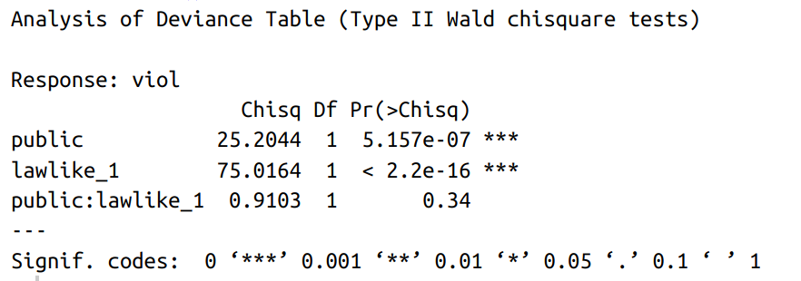

```{r setup, include=FALSE}
knitr::opts_knit$set(root.dir = rprojroot::find_rstudio_root_file())
knitr::opts_chunk$set(echo = FALSE, message = FALSE, warning = FALSE, results = 'asis')
knitr::opts_chunk$set(dev = 'svg') 
```
class: title-slide-custom

<br>

<div style="margin-top: 10%;
  font-size: 70px;font-family: 'Yanone Kaffeesatz';"> Normative ignorance <br> and the folk concept of legal rule</div>

.bottom[
.title-author[**Piotr Bystranowski**]

.title-author[Max Planck Institute for Research on Collective Goods <br />] <br /><br /><br>

.title-bottom[Bonn<br />May 22nd, 2024]]


---

.left-column[<div class="big">The basic tension</div>]

.right-column[<br><br><br><br><br><br>
.list1[<div style="text-align: center">
<i>Sorry, I didn't know I wasn't allowed to do that</i>.<br><br>
vs.<br><br>
<i>Ignorance of law is no excuse</i>.</div>
]
]

---

class: inverse

### But does normative ignorance, in general, exculpate?

#### Scarce and mixed results


.ex1[]


.ex2[]


.ex3[]


.ex4[]

---

.left-column[<div class="big">Research<br /> objectives</div>]
.right-column[

1. Does normative ignorance limit responsibility for violating conventional social rules?

1. If so, is this effect moderated by the legal character of a given rule?

1. If so, what could explain that moderation?
]

---
.left-column[<div class="big">General <br> approach</div>]
.right-column[ 

]
---

class: inverse, middle, center

# Study 1

---

.left-column[<div class="big">Stimuli</div>]

.right-column[
<div style="font-size:30px;">24 hypothetical social rules.</div>

.list1[
- 7 types of sources:
.list2[
- statute vs. 
- case law vs. 
- custom vs. 
- public establishment vs. 
- informal group vs. 
- household
]
- nested within that: .list2[
- *malum in se* vs. *malum prohibitum*
]
- nested within that: .list2[
- rule vs. standard.
]]
]
---
.left-column[<div class="big">Case law</div>]
.right-column[
```{r s1Sample, eval=TRUE, echo=FALSE, message=FALSE, warning=FALSE}

library(tidyverse)
library(kableExtra)

# Create a data frame to represent the table's content
legal_standards <- data.frame(
  #Aspect = c("Description", "Rule", "Standard", "Description", "Rule", "Standard"),
  `Malum prohibitum` = c(
    "Some musicians use samples from other musicians' recordings. Sampling is the reuse of a portion of a sound recording in another recording. Sampling is often considered a breach of the copyrights of the original recording. It is not always clear when sampling is protected by the fair use doctrine, which would mean that the artist doesn't need to get permission from the copyright owner. In a recent ruling, the Supreme Court of Figuria decided the following:",
    "Whenever the sampling artist uses more than 10% of the original recording, they need to acquire permission of the copyright owner.",
    "Whenever the sampling artist uses a non-negligible portion of the original recording, they need to acquire permission of the copyright owner.",
    "Ambrose is a young musician, self-producing his music. He has heard about/doesn't know* the new rule. In his recent recording, which is currently trending on TikTok, Ambrose reused about 30% of a song by the acclaimed German electroband, Kraftwerk, without acquiring permission."),
  `Malum in se` = c(
    "A frequent cause of neighborhood disputes is noise, especially during nighttime hours. In a recent ruling, the Supreme Court of Figuria decided the following:",
    "In multi-unit residential buildings, playing music between the hours of 10 p.m. and 6 a.m. is prohibited.",
    "In multi-unit residential buildings, producing unreasonable noise between the hours of 10 p.m. and 6 a.m. is prohibited.",
    "Ambrose has heard about/doesn't know* the new rule. One Saturday evening, Ambrose held a rehearsal of his rock band at his apartment from 9pm to 10:30pm, and the resulting noise was audible to his neighbors."
  ))

# Use kable and kableExtra to format the PDF table
knitr::kable(legal_standards, "html", booktabs = T, longtable = T) %>%
  kable_styling(font_size = 12) %>%
  column_spec(c(1,2), width = "8cm") %>%
  pack_rows("Rule",2,2) %>% 
  pack_rows("Standard",3,3) %>% 
  pack_rows("Vignette (only Part 2)",4,4) %>% 
  row_spec(c(2,3), italic = T) %>% 
  footnote(symbol="Randomly varied between subjects.")
```
]


---

.left-column[<div class="big">Procedure</div>]

.right-column[<br><br>
.list1[
- 6 trials
.list2[
- each followed by the main measure: *To what extent do you agree with the following statement: **The presented rule is a typical legal rule*** [0-100]
]
- after all trials: 
.list2[
- an open-ended question;
- follow-up measures of *seriousness of context*; *moral wrongness of violating the rule*.
]
]

]

---

.left-column[<div class="big">Sample</div>]

.right-column[<br><br>
.list1[
- 200 Prolific workers
- U.K. residents
- English as first language
- at least secondary education completed
]
]

---

.left-column[<div class="big">Lawlikeness<br>by source</div>]

.right-column[
```{r fig1, fig.height=5.5}

source("src/10_plot1.R")
plot
```
]

---


.anova[]

.right-column[
```{r fig.height=4.5}
source("src/10_analysis.R")
interactions::interact_plot(m3, serious, Source)
```
]

---

.right-column[
```{r}
lavaanPlot(model = fit, coefs=T, stars = c("regress"))
```
]

---

.left-column[<div class="big">Part 2</div>]

.right-column[


]

---

```{r fig.height=6.5}
source("src/11_plot2.R")
fig
```

---

```{r models1, echo=F, message=F, warning=F}
source("src/11_analysis.R")

tribble(~term, ~B, ~t, ~p, ~B, ~t, ~p,
        "Intercept", round(jtools::summ(m1_wrong)$coeftable[1],2),round(jtools::summ(m1_wrong)$coeftable[5],2), "<.001", round(jtools::summ(m2_wrong)$coeftable[1],2),round(jtools::summ(m2_wrong)$coeftable[9],2), "<.001",
        "Ignorance", round(jtools::summ(m1_wrong)$coeftable[2],2),round(jtools::summ(m1_wrong)$coeftable[6],2), "<.001", round(jtools::summ(m2_wrong)$coeftable[3],2),round(jtools::summ(m2_wrong)$coeftable[11],2), "<.001",
        "Lawlike", NA,NA,NA, round(jtools::summ(m2_wrong)$coeftable[2],2),round(jtools::summ(m2_wrong)$coeftable[10],2), "<.001",
        "Ignorance x Lawlike", NA,NA,NA, round(jtools::summ(m2_wrong)$coeftable[4],2),round(jtools::summ(m2_wrong)$coeftable[12],2), "<.001",
#now the same for repri
        "Intercept", round(jtools::summ(m1_repri)$coeftable[1],2),round(jtools::summ(m1_repri)$coeftable[5],2), "<.001", round(jtools::summ(m2_repri)$coeftable[1],2),round(jtools::summ(m2_repri)$coeftable[9],2), "<.001",
        "Ignorance", round(jtools::summ(m1_repri)$coeftable[2],2),round(jtools::summ(m1_repri)$coeftable[6],2), "<.001", round(jtools::summ(m2_repri)$coeftable[3],2),round(jtools::summ(m2_repri)$coeftable[11],2), "<.001",
        "Lawlike", NA,NA,NA, round(jtools::summ(m2_repri)$coeftable[2],2),round(jtools::summ(m2_repri)$coeftable[10],2), "<.001",
        "Ignorance x Lawlike", NA,NA,NA, round(jtools::summ(m2_repri)$coeftable[4],2),round(jtools::summ(m2_repri)$coeftable[12],2), "<.001",
# viol
        "Intercept", round(jtools::summ(m1_viol)$coeftable[1],2),round(jtools::summ(m1_viol)$coeftable[5],2), "<.001", round(jtools::summ(m2_viol)$coeftable[1],2),round(jtools::summ(m2_viol)$coeftable[9],2), "<.001",
        "Ignorance", round(jtools::summ(m1_viol)$coeftable[2],2),round(jtools::summ(m1_viol)$coeftable[6],2), "<.001", round(jtools::summ(m2_viol)$coeftable[3],2),round(jtools::summ(m2_viol)$coeftable[11],2), "<.001",
        "Lawlike", NA,NA,NA, round(jtools::summ(m2_viol)$coeftable[2],2),round(jtools::summ(m2_viol)$coeftable[10],2), "<.001",
        "Ignorance x Lawlike", NA,NA,NA, round(jtools::summ(m2_viol)$coeftable[4],2),round(jtools::summ(m2_viol)$coeftable[12],2), "<.001",
# person
        "Intercept", round(jtools::summ(m1_person)$coeftable[1],2),round(jtools::summ(m1_person)$coeftable[5],2), "<.001", round(jtools::summ(m2_person)$coeftable[1],2),round(jtools::summ(m2_person)$coeftable[9],2), "<.001",
        "Ignorance", round(jtools::summ(m1_person)$coeftable[2],2),round(jtools::summ(m1_person)$coeftable[6],2), "<.001", round(jtools::summ(m2_person)$coeftable[3],2),round(jtools::summ(m2_person)$coeftable[11],2), "<.001",
        "Lawlike", NA, NA, NA, round(jtools::summ(m2_person)$coeftable[2],2),round(jtools::summ(m2_person)$coeftable[10],2), as.character(round(jtools::summ(m2_person)$coeftable[18],3)),
        "Ignorance x Lawlike", NA, NA, NA, round(jtools::summ(m2_person)$coeftable[4],2),round(jtools::summ(m2_person)$coeftable[12],2), as.character(round(jtools::summ(m2_person)$coeftable[20],2))
) %>% 
  kable("html", booktabs = T) %>% 
  kable_styling(font_size = 12) %>% 
  add_header_above(c(" ", "Model 1" = 3, "Model 2" = 3)) %>%
  pack_rows("Act's wrongness", 1, 4) %>%
  pack_rows("Agent's desert", 5, 8) %>%
  pack_rows("Rule violation", 9, 12) %>%
  pack_rows("Agent is a good person", 13, 16) %>%
  column_spec(1, width = "5cm") %>% 
  column_spec(2:7, width = "2cm")

```

---

.left-column[<div class="big">A philosophical<br>interlude</div>]

.right-column[<br><br>
.list1[
- Hart, *CoL*, Ch. VI:
.list2[
- non-legal social rules are contingent on general acceptance of people they are addressed to (PB: *acceptance* implies *awareness*);
- legal (primary) rules are contingent *only* on the rule of recognition, as practiced by legal officials, and on the general efficacy of the legal system *as a whole*.
]
- This seems testable: can we observe a three-way interaction: Ignorance x lawlikeness x *publicity*?
]

]
---
class: inverse, middle, center

# Study 2

---

.left-column[<div class="big">Study 2</div>]

.right-column[
<br>
.list1[
- confirmatory,
- crowdsourced stimuli,
- new measure: perceived rule publicity,
- individual differences: 
.list2[
- empathic concern,
- right-wing authoritarianism,
- need for closure.
]
]]

---

.left-column[<div class="big">Stimuli</div>]


.right-column[

.list1[
- 150 Prolific workers, paid for one rule, extra reward for two more,
- 1/3: legal rule; 1/3: non-legal rule; 1/3: no specification;
- 89 rules included, redrafted into stimuli with the help of GPT.
]
]

---

.left-column[<div class="big">Stimuli</div>]


.right-column[
```{r stim2, echo=F, message=F, warning=F}
lawlike_means <- read_csv("data/21_lawlike_means.csv")
tribble(~" ", ~Rule, ~lawlikeness, ~seriousness, ~publicity,
        "Min", "At Fitness First, a common understanding among members is to respect personal belongings left near gym equipment, indicating that someone is currently using or intending to return to that equipment.", round(lawlike_means[lawlike_means$Rule=="gym_possessions", "lawlike_1"],2), round(lawlike_means[lawlike_means$Rule=="gym_possessions", "serious_1"],2), round(lawlike_means[lawlike_means$Rule=="gym_possessions", "public_1"],2),
        "1Q", "Green Valley Supermarket encourages a respectful checkout experience, which includes not using phones while packing groceries. This practice shows courtesy to the cashiers and ensures efficient service for everyone.", round(lawlike_means[lawlike_means$Rule=="phone_shopping", "lawlike_1"],2), round(lawlike_means[lawlike_means$Rule=="phone_shopping", "serious_1"],2), round(lawlike_means[lawlike_means$Rule=="phone_shopping", "public_1"],2),
        "Median", "Vertex Solutions, a digital marketing firm, has a strict policy regarding client communications: Employees must not use generative AI tools to draft emails to clients. This policy ensures that all client communication is personalized, thoughtful, and maintains the company's standard of human touch.", round(lawlike_means[lawlike_means$Rule=="generative_ai", "lawlike_1"],2), round(lawlike_means[lawlike_means$Rule=="generative_ai", "serious_1"],2), round(lawlike_means[lawlike_means$Rule=="generative_ai", "public_1"],2),
        "3Q", "By law, it is prohibited to engage in gambling in the premises of public libraries. This rule is in place to maintain an environment conducive to reading and studying.", round(lawlike_means[lawlike_means$Rule=="gambling_library", "lawlike_1"],2), round(lawlike_means[lawlike_means$Rule=="gambling_library", "serious_1"],2), round(lawlike_means[lawlike_means$Rule=="gambling_library", "public_1"],2),
        "Max", "All car owners must insure their vehicles, regardless of usage, unless the vehicles are officially declared as non-operational.", round(lawlike_means[lawlike_means$Rule=="insure_car", "lawlike_1"],2), round(lawlike_means[lawlike_means$Rule=="insure_car", "serious_1"],2), round(lawlike_means[lawlike_means$Rule=="insure_car", "public_1"],2)) %>% 
  kable("html", booktabs = T, longtable=T ) %>% 
  kable_styling(font_size=12) %>% 
  column_spec(2, width = "8cm") 
```
]

---
```{r fig.height=6.5}

library(ggrepel)
long <- read_csv("data/20_long.csv")

long %>% group_by(Rule) %>% 
  summarise(n=n(), lawlike=mean(lawlike), public=mean(public)) %>% 
  ggplot(aes(lawlike, public, label=Rule))+
  geom_text_repel(size=3)+geom_smooth(method='lm')+ylim(c(0,100))
```

---

.left-column[<div class="big">Part 2:<br>H1 & H2</div>]

.right-column[
```{r fig.height=6}
source("src/23_joint.R")
```
]

---

.left-column[<div class="big">H3 & H4</div>]

.right-column[

<div style="position:absolute; top:5%; left:5%; width:45%"> 

</div>

<div style="position:absolute; top:40%; left:5%; width:45%"> 

</div>

<div style="position:absolute; bottom:5%; left:5%; width:45%"> 

</div>

<div style="position:absolute; top:5%; right:5%; width:45%"> 

</div>

<div style="
    position: absolute;
    left: 49%;
    top: 0;
    bottom: 0;
    border-left: 2px dashed rgba(0, 0, 0, 0.5);
    transform: translateX(-50%);"></div>

<div style="position:absolute; top:40%; right:5%; width:45%"> 

</div>

<div style="position:absolute; bottom:5%; right:5%; width:45%"> 

</div>

]

---

.left-column[<div class="big">Individual<br>differences</div>]

.right-column[<br><br><br><br><br><br>
- almost no interaction between ID measures and Ignorance or three-way interaction with Ignorance and lawlikeness;
- but: religious people discriminate *more* between ignorant and knowledgeable agents;
- consistently, people high on NfC, RWA, religiosity and low on EC discriminate *less* between legal and non-legal rules.
]

---

.left_column[<div class="big">Experimental manipulation<br>and publicity</div>]

.right-column[
.list1[
- Experimental condition predicts the ex post publicity measure (*B* = -0.43, *t* = -5.17, *p* < .001)
- This effect is moderated by lawlikeness (*B* = 0.003, *t* = 3.17, *p* = 0.002)


]]
---
class: inverse, middle, center

# Study 3
---

.left-column[<div class="big">Study 3</div>]

.right-column[
.list1[
- reuse cases of ignorant violations from Study 2,
- add an experimental manipulation of the level of publicity of a given rule.
]

]

---

.left-column[<div class="big">H1 & H2</div>]

.right-column[
<div style="position:absolute; top:5%; left:35%; width:45%"> 

</div>

<div style="position:absolute; top:40%; left:35%; width:45%"> 

</div>

<div style="position:absolute; bottom:5%; left:35%; width:45%"> 

</div>
]

---

```{r fig.height=6}
read_csv("data/31_long.csv") %>% 
  mutate(quartile = as.factor(ntile(lawlike_1,4))) %>%
  filter(quartile %in% c(1,4)) %>%
  ggplot(aes(public, viol))+geom_smooth(aes(col=quartile))+geom_smooth()+
  guides(col=guide_legend(title="Lawlikeness \n quartile"))+
  theme_bw()
```

---
class: inverse, middle, center

# Study 4

---

.left-column[<div class="big">Study 4]</div>

.right-column[
.list1[
- blame updating paradigm
.list2[
- successfully applied in the context of intent/factual ignorance (Monroe & Malle, 2019)
- less successfully applied in the context of moral ignorance (Theisen & Andow, 2024)
- here applied to all responsibility measures + perceived publicity
]
- four experimental conditions:
.list2[
- knowledge (*X knew the rule*); 
- pure ignorance (*X did not know the rule*); 
- culpable ignorance (*X didn’t know the rule. He usually doesn’t put much effort into learning rules like this one, neither did he this time*); 
- innocent ignorance (*X didn’t know the rule. He normally puts much effort into learning rules like this one. In this case, he had asked [a friend] about the relevant rules but was given incorrect information*).
]
]]
---

.left-column[<div class="big">H1</div>]

.right-column[
```{r fig5, echo=F, message=F, warning=F, fig.height=7}
source("src/41_analysis.R")
plot6
```
]

---

.left-column[<div class="big">H2</div>]

.right-column[

<div style="position:absolute; top:30%; left:5%; width:45%"> 

</div>

<div style="position:absolute; top:30%; right:5%; width:45%"> 

</div>

<div style="position:absolute; bottom:15%; left:5%; width:45%"> 

</div>

<div style="position:absolute; bottom:15%; right:5%; width:45%"> 

</div>
]
---

.left-column[<div class="big">H3</div>]

.right-column[


]
---


.right-column[


]
---

.left-column[<div class="big">Conclusion</div>]

.right-column[
.list1[
- normative ignorance limits the ascriptions of desert, wrongness, rule violation;
- this effect is moderated by the perceived lawlikeness of a given rule;
- the moderation can be explained by the observation that:
.list2[
- effect of ignorance on rule violation is moderated by an update of perceived rule's publicity;
- the update is more conservative for legal rules.
]
]
]

---

class: center, middle

# Thanks!

Slides created via the R package [**xaringan**](https://github.com/yihui/xaringan).

The chakra comes from [remark.js](https://remarkjs.com), [**knitr**](https://yihui.org/knitr/), and [R Markdown](https://rmarkdown.rstudio.com).
