```{r setup, include=FALSE}
knitr::opts_knit$set(root.dir = rprojroot::find_rstudio_root_file())
knitr::opts_chunk$set(echo = FALSE, message = FALSE, warning = FALSE, results = 'asis')
knitr::opts_chunk$set(dev = 'svg') 
```
class: title-slide-custom

<br>

<div style="margin-top: 10%;
  font-size: 70px;font-family: 'Yanone Kaffeesatz';"> Normative ignorance <br> and the folk concept of legal rule</div>

.bottom[
.title-author[**Piotr Bystranowski**]

.title-author[Max Planck Institute for Research on Collective Goods <br />] <br /><br /><br>

.title-bottom[Bonn<br />February 19th, 2024]]


---

.left-column[<div class="big">The basic tension</div>]

.right-column[<br><br><br><br><br><br>
.list1[<div style="text-align: center">
<i>Sorry, I didn't know I wasn't allowed to do that</i>.<br><br>
vs.<br><br>
<i>Ignorance of law is no excuse</i>.</div>
]
]

---

class: inverse

### But does normative ignorance, in general, exculpate?

#### Scarce and mixed results


.ex1[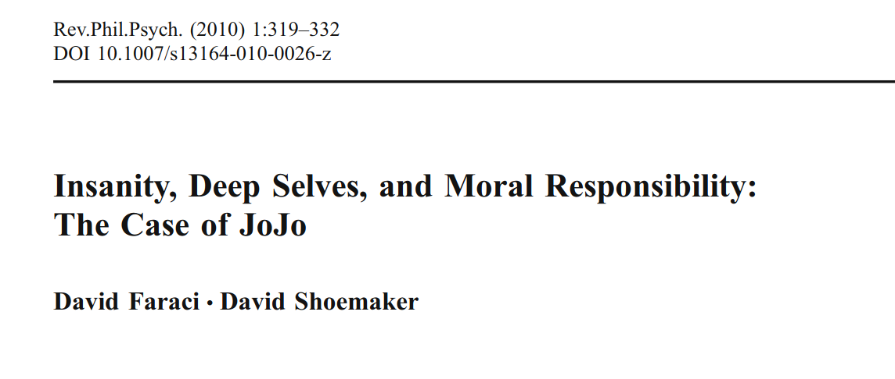]


.ex2[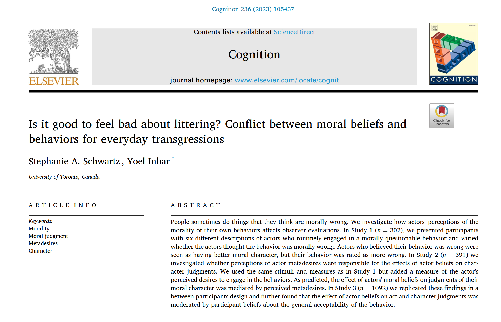]


.ex3[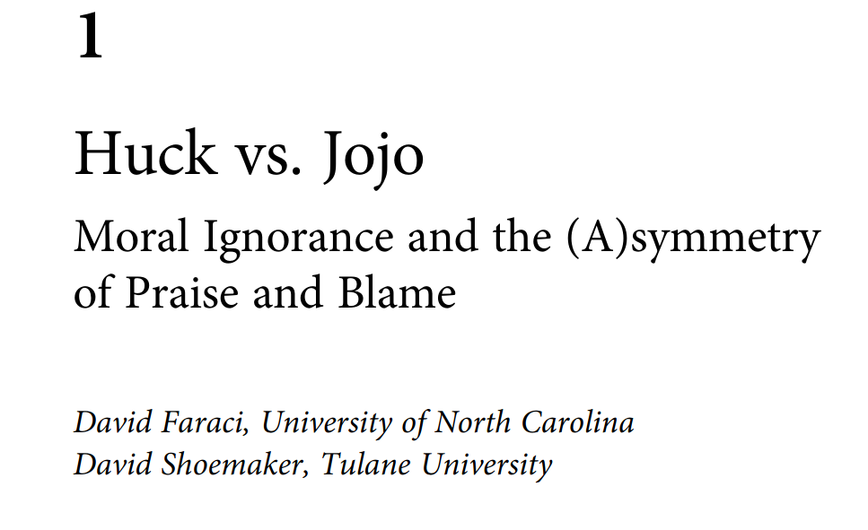]


.ex4[]

---

.left-column[<div class="big">Research<br /> objectives</div>]
.right-column[

1. Does normative ignorance limit responsibility for violating conventional social rules?

1. If so, is this effect moderated by the legal character of a given rule?

1. If so, what could explain that moderation?
]

---
.left-column[<div class="big">General <br> approach</div>]
.right-column[ 

]
---

class: inverse, middle, center

# Study 1

---

.left-column[<div class="big">Stimuli</div>]

.right-column[
<div style="font-size:30px;">24 hypothetical social rules.</div>

.list1[
- 7 types of sources:
.list2[
- statute vs. 
- case law vs. 
- custom vs. 
- public establishment vs. 
- informal group vs. 
- household
]
- nested within that: .list2[
- *malum in se* vs. *malum prohibitum*
]
- nested within that: .list2[
- rule vs. standard.
]]
]
---
.left-column[<div class="big">Case law</div>]
.right-column[
<br>
<table style="border-collapse: collapse; width: 100%; font-size: small; border: 1px solid #CCCCCC;">
    <thead>
        <tr style="background-color: #F9F9F9;">
            <th style="padding: 8px; border: 1px solid #CCCCCC;">Malum Prohibitum</th>
            <th style="padding: 8px; border: 1px solid #CCCCCC;">Malum in Se</th>
        </tr>
    </thead>
    <tbody>
        <tr>
            <td style="padding: 8px; border: 1px solid #CCCCCC;">
                <p>Some musicians use samples from other musicians' recordings.</p>
                <p>Sampling is the reuse of a portion of a sound recording in another recording.</p>
                <p>Sampling is often considered a breach of the copyrights of the original recording.</p>
                <p>It is not always clear <u>when sampling is protected by the fair use doctrine</u>, which would mean that the artist doesn't need to get permission from the copyright owner.</p>
                <p>In a <u>recent ruling</u>, the Supreme Court of Figuria decided the following:</p>
            </td>
            <td style="padding: 8px; border: 1px solid #CCCCCC;">
                <p>A frequent cause of neighborhood disputes is <u>noise, especially during nighttime hours</u>.</p>
                <p>In a <u>recent ruling</u>, the Supreme Court of Figuria decided the following:</p>
            </td>
        </tr>
        <tr>
            <td style="padding: 8px; border: 1px solid #CCCCCC;"><b>[Rule:]</b> "Whenever the sampling artist uses more than 10% of the original recording, they need to acquire permission of the copyright owner."</td>
            <td style="padding: 8px; border: 1px solid #CCCCCC;"><b>[Rule:]</b> "In multi-unit residential buildings, playing music between the hours of 10 p.m. and 6 a.m. is prohibited."</td>
        </tr>
        <tr>
            <td style="padding: 8px; border: 1px solid #CCCCCC;"><b>[Standard:]</b> "Whenever the sampling artist uses a non-negligible portion of the original recording, they need to acquire permission of the copyright owner."</td>
            <td style="padding: 8px; border: 1px solid #CCCCCC;"><b>[Standard:]</b> "In multi-unit residential buildings, producing unreasonable noise between the hours of 10 p.m. and 6 a.m. is prohibited."</td>
        </tr>
    </tbody>
</table>
]


---

.left-column[<div class="big">Procedure</div>]

.right-column[<br><br>
.list1[
- 6 trials
.list2[
- each followed by the main measure: *To what extent do you agree with the following statement: **The presented rule is a typical legal rule*** [0-100]
]
- after all trials: 
.list2[
- an open-ended question;
- follow-up measures of *seriousness of context*; *moral wrongness of violating the rule*.
]
]

]

---

.left-column[<div class="big">Sample</div>]

.right-column[<br><br>
.list1[
- 200 Prolific workers
- U.K. residents
- English as first language
- at least secondary education completed
]
]

---

.left-column[<div class="big">Lawlikeness<br>by source</div>]

.right-column[
```{r fig1, fig.height=5.5}

source("plot_2.R")
plot
```
]

---


.anova[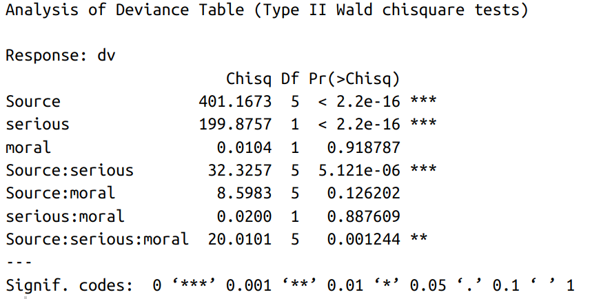]

.right-column[
```{r fig.height=4.5}
source("src/10_analysis.R")
interactions::interact_plot(m3, serious, Source)
```
]

---

.right-column[
```{r}
lavaanPlot(model = fit, coefs=T, stars = c("regress"))
```
]

---

.left-column[<div class="big">Part 2</div>]

.right-column[

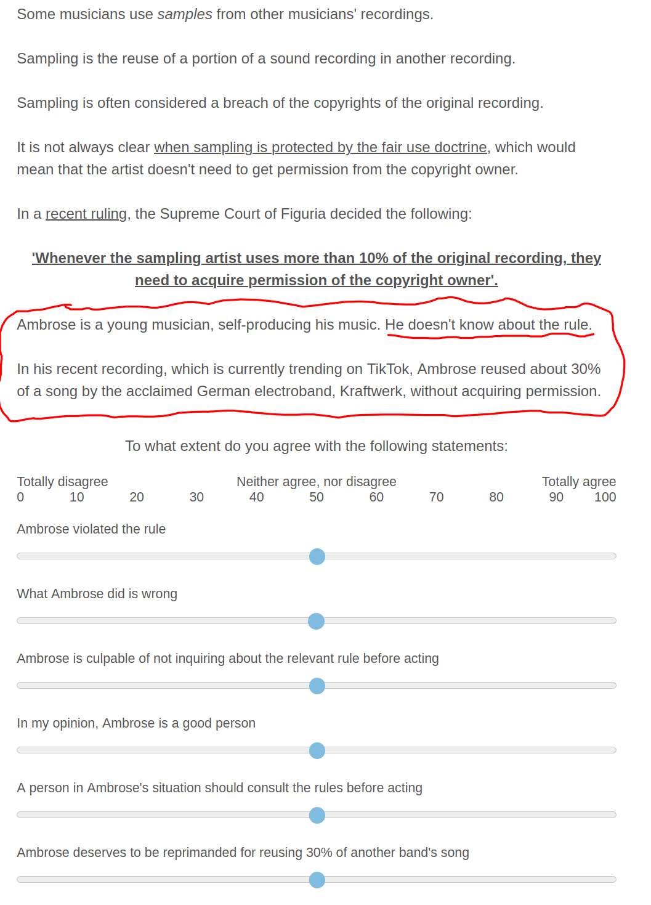
]

---

```{r fig.height=6.5}
source("plot_1.R")
fig
```

---

<div style="position:absolute; top:5%; left:5%; width:45%"> 

</div>

<div style="position:absolute; top:25%; right:5%; width:45%"> 

</div>

<div style="position:absolute; bottom:25%; left:5%; width:45%"> 

</div>

<div style="position:absolute; bottom:5%; right:5%; width:45%"> 

</div>
---


.anova[]

.right-column[
```{r fig.height=3.5}
source("src/11_analysis.R")
interactions::interact_plot(m2, lawlike, Ignorance, mod2 = "stand")
```
]

---

.left-column[<div class="big">A philosophical<br>interlude</div>]

.right-column[<br><br>
.list1[
- Hart, *CoL*, Ch. VI:
.list2[
- non-legal social rules are contingent on general acceptance of people they are addressed to (PB: *acceptance* implies *awareness*);
- legal (primary) rules are contingent *only* on the rule of recognition, as practiced by legal officials, and on the general efficacy of the legal system *as a whole*.
]
- This seems testable: can we observe a three-way interaction: Ignorance x lawlikeness x *publicity*?
]

]
---
class: inverse, middle, center

# Study 2

---

.left-column[<div class="big">Study 2</div>]

.right-column[
<br>
.list1[
- confirmatory,
- crowdsourced stimuli,
- new measure: perceived rule publicity,
- individual differences: 
.list2[
- empathic concern,
- right-wing authoritarianism,
- need for closure.
]
]]

---

.left-column[<div class="big">Stimuli</div>]


.right-column[
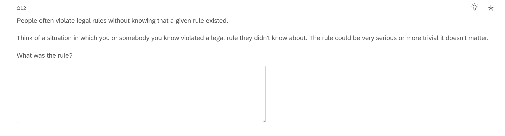
.list1[
- 150 Prolific workers, paid for one rule, extra reward for two more,
- 1/3: legal rule; 1/3: non-legal rule; 1/3: no specification;
- 89 rules included, redrafted into stimuli with the help of GPT.
]
]

---
.left-column[<div class="big">Stimuli</div>]


.right-column[<br><br>
<table style="border-collapse: collapse; width: 100%; font-size: small; border: 1px solid #CCCCCC;">
    <tbody>
        <tr>
            <td style="padding: 8px; border: 1px solid #CCCCCC;">Min</td>
            <td style="padding: 8px; border: 1px solid #CCCCCC;">
                Chris and Alex, a couple actively involved in transgender rights advocacy, prefer not to discuss "Harry Potter" at their gatherings due to J.K. Rowling's controversial statements on transgender issues.
            </td>
        </tr>
        <tr>
            <td style="padding: 8px; border: 1px solid #CCCCCC;">Median</td>
            <td style="padding: 8px; border: 1px solid #CCCCCC;">
                At Zenith Corporation, a clear policy is in place regarding the use of the company car park: It is exclusively reserved for clients. Employees are encouraged to use alternative parking arrangements. This policy ensures that clients always have convenient access when visiting the office.
            </td>
        </tr>
        <tr>
            <td style="padding: 8px; border: 1px solid #CCCCCC;">Max</td>
            <td style="padding: 8px; border: 1px solid #CCCCCC;">
                All car owners must insure their vehicles, regardless of usage, unless the vehicles are officially declared as non-operational.
            </td>
        </tr>
    </tbody>
</table>
]

---
```{r fig.height=6.5}
library(ggrepel)
long <- read_csv("data/20_long.csv")
long %>% group_by(Rule) %>% 
  summarise(n=n(), lawlike=mean(lawlike), serious=mean(serious)) %>% 
  ggplot(aes(serious, lawlike, label=Rule))+
  geom_text_repel(size=3)+geom_smooth(method='lm')
```

---
```{r fig.height=6.5}

long %>% group_by(Rule) %>% 
  summarise(n=n(), lawlike=mean(lawlike), public=mean(public)) %>% 
  ggplot(aes(public, lawlike, label=Rule))+
  geom_text_repel(size=3)+geom_smooth(method='lm')
```
---

.left-column[<div class="big">Religion and<br>lawlikeness</div>]

.right-column[<br><br><br><br><br>

]
---


---

.left-column[<div class="big">Part 2:<br>H1 & H2</div>]

.right-column[
```{r fig.height=6}
source("src/23_joint.R")
```
]

---

.left-column[<div class="big">H3 & H4</div>]

.right-column[

<div style="position:absolute; top:5%; left:5%; width:45%"> 

</div>

<div style="position:absolute; top:40%; left:5%; width:45%"> 

</div>

<div style="position:absolute; bottom:5%; left:5%; width:45%"> 
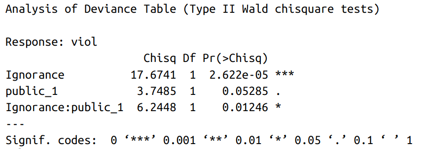
</div>

<div style="position:absolute; top:5%; right:5%; width:45%"> 
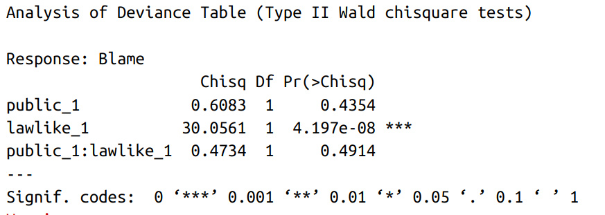
</div>

<div style="
    position: absolute;
    left: 49%;
    top: 0;
    bottom: 0;
    border-left: 2px dashed rgba(0, 0, 0, 0.5);
    transform: translateX(-50%);"></div>

<div style="position:absolute; top:40%; right:5%; width:45%"> 

</div>

<div style="position:absolute; bottom:5%; right:5%; width:45%"> 
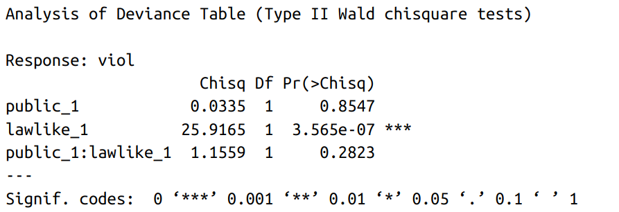
</div>

]

---

.left-column[<div class="big">Individual<br>differences</div>]

.right-column[<br><br><br><br><br><br>
- almost no interaction between ID measures and Ignorance or three-way interaction with Ignorance and lawlikeness;
- but: religious people discriminate *more* between ignorant and knowledgeable agents;
- consistently, people high on NfC, RWA, religiosity and low on EC discriminate *less* between legal and non-legal rules.
]

---
class: inverse, middle, center

# Study 3
---

.left-column[<div class="big">Study 3</div>]

.right-column[
.list1[
- reuse cases of ignorant violations from Study 2,
- add an experimental manipulation of the level of publicity of a given rule.
]
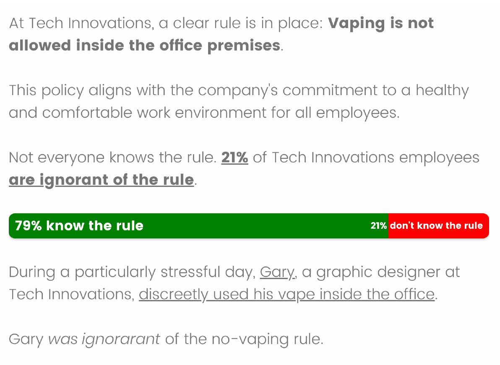
]

---

.left-column[<div class="big">H1 & H2</div>]

.right-column[
<div style="position:absolute; top:5%; left:35%; width:45%"> 

</div>

<div style="position:absolute; top:40%; left:35%; width:45%"> 
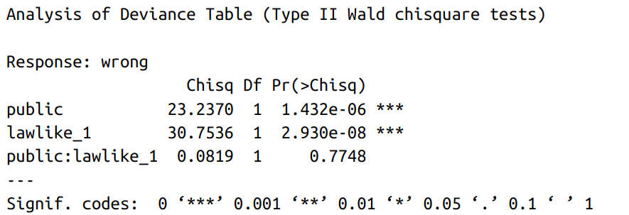
</div>

<div style="position:absolute; bottom:5%; left:35%; width:45%"> 

</div>
]

---

```{r fig.height=6}
read_csv("data/31_long.csv") %>% 
  mutate(quartile = as.factor(ntile(lawlike_1,4))) %>%
  filter(quartile %in% c(1,4)) %>%
  ggplot(aes(public, viol))+geom_smooth(aes(col=quartile))+geom_smooth()+
  guides(col=guide_legend(title="Lawlikeness \n quartile"))+
  theme_bw()
```

---
class: center, middle

# Thanks!

Slides created via the R package [**xaringan**](https://github.com/yihui/xaringan).

The chakra comes from [remark.js](https://remarkjs.com), [**knitr**](https://yihui.org/knitr/), and [R Markdown](https://rmarkdown.rstudio.com).
